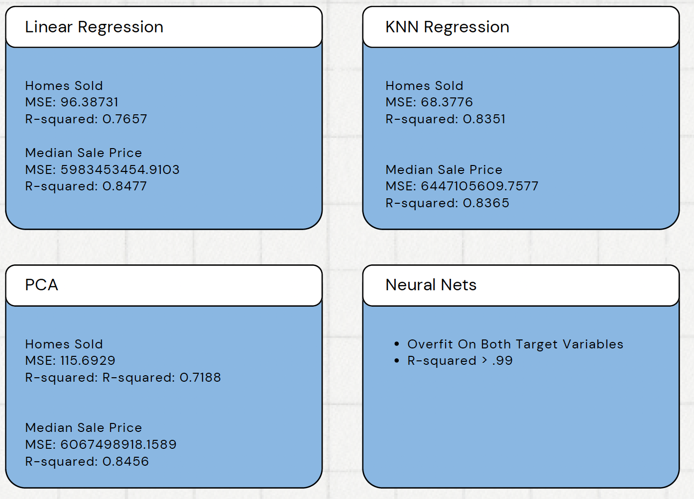

## Home, Home Alone: A Machine Learning Approach to Tackle Inefficiencies in the Real Estate Market
=========================

### Project Overview:

#### Problem Area:
There are many challenges within the real estate market. We can take a look at the challenges faced by both sides: sellers who are listing new properties and buyers who are looking to acquire new properties. Some of the main problems faced by buyers include: housing affordability, limited inventory, emotional stress and decision fatigue, and location constraints. Some of the main problems faced by sellers are unused inventory, poor marketing, and volatile markets. Furthermore, the Covid pandemic largely affected both sides of the housing market, creating instability in the median prices of properties. 

#### Users affected:
The users in the United States directly affected by this problem are individuals/families that are looking to purchase a property as well as the sellers (in our case interested in the real estate agents) that have listed a new property for sale. 

#### Proposed Data Science solution:
Given a sufficiently large dataset, one can deeply analyze the housing market in the United States over the most recent decade, determine key patterns in terms of inventory, prices across property types, and demand (number of properties sold) across different regions, and use machine learning to make predictions about these variables in the future.

#### The impact of my solution:
Improving the accuracy of a machine learning model with the goal of significantly surpassing baseline accuracy across predicting inventory, property sale prices, and number of property sales would greatly serve millions of buyers and sellers in the United States, potentially generating hundreds of millions of dollars by making better use of inventory resources, marketing strategies, and decreased number of pending sales. 

#### Description of dataset:
The raw data set was attained from Kaggle.com and it was gathered by Redfin, a real estate brokerage company with an online platform connecting users to listed properties as well as real estate agents. The data set is freqently updated with ranges between 2012 and early 2024. Additionally, it contains over 5 million rows and 58 columns. 

After preprocessing here are the columns of interest:

| **Column Name**                             | **Description**                                                                                                                                      |
|---------------------------------------------|------------------------------------------------------------------------------------------------------------------------------------------------------|
| `median_sale_price`                         | The median price of homes sold in the specified time period, representing the middle point of sale prices.                                             |
| `median_list_price`                         | The median price at which homes were listed for sale in the specified time period.                                                                    |
| `median_ppsf`                               | The median price per square foot for homes sold during the specified period.                                                                          |
| `median_list_ppsf`                          | The median list price per square foot for homes listed during the specified time period.                                                              |
| `homes_sold`                                | The number of homes sold during the specified time period.                                                                                            |
| `inventory`                                 | The total number of homes available for sale at the end of the specified time period.                                                                 |
| `months_of_supply`                          | The number of months it would take to sell the current inventory of homes at the current sales pace.                                                  |
| `median_dom`                                | Median days on market — the median number of days homes are listed before being sold.                                                                 |
| `year`                                      | The year in which the data was recorded.                                                                                                              |
| `month`                                     | The month in which the data was recorded.                                                                                                             |
| `season`                                    | The season (Winter, Spring, Summer, Fall) during which the data was recorded.                                                                         |
| `sale_to_list_ratio`                        | The ratio of the sale price to the list price, typically expressed as a percentage. Represents how much buyers are paying compared to the list price.  |
| `price_growth`                              | The percentage change in prices over a given period, indicating market trends and appreciation or depreciation of home values.                        |
| `buyer_utility`                             | A calculated measure representing the perceived value or satisfaction buyers get from purchasing a home, considering price and features.               |
| `pending_sales_ratio`                       | The ratio of pending sales to active listings, indicating the level of demand in the housing market.                                                  |
| `sales_success_rate`                        | The percentage of homes that successfully sold compared to the total number listed for sale.                                                          |
| `inventory_turnover`                        | The rate at which homes are sold relative to the total inventory, indicating market velocity or activity.                                              |
| `adjusted_months_supply`                    | A calculated value adjusting the months of supply based on specific market conditions or seasonality.                                                 |
| `political_stance_encoded`                  | Encoded variable representing the political stance of the region, typically based on voting patterns or demographic data.                             |
| `supply_to_list_ratio`                      | The ratio of available housing supply to the number of new listings, which can indicate market saturation or housing availability.                     |
| `property_type_All Residential`             | Indicator variable for whether the property is classified as "All Residential" (inclusive of all residential property types).                         |
| `property_type_Single Family Residential`   | Indicator variable for whether the property is classified as a "Single Family Residential" home.                                                      |
| `state_avg_sale_price`                      | The average sale price for homes in a specific state.                                                                                                 |
| `metro_region_inventory_change`             | The change in the number of homes available for sale in a specific metro region compared to a previous time period.                                    |
| `inventory_to_pending_ratio`                | The ratio of total inventory to pending sales, used to assess the balance between supply and demand in the market.                                     |
| `rolling_median_sale_price`                 | The median sale price calculated over a rolling time window (e.g., 3 months, 6 months) to smooth out short-term fluctuations.                         |
| `rolling_median_list_price`                 | The median list price calculated over a rolling time window to smooth out short-term fluctuations.                                                    |
| `price_momentum`                            | A measure of the rate of change in home prices, indicating whether prices are accelerating or decelerating in the market.                             |
| `supply_pressure`                           | A measure of the level of pressure exerted by the housing supply, with higher values indicating oversupply.                                            |
| `demand_pressure`                           | A measure of the level of pressure exerted by housing demand, with higher values indicating high competition among buyers.                             |
| `price_elasticity`                          | A measure of how sensitive home prices are to changes in other factors such as demand, interest rates, or supply.                                      |
| `us_region_East North Central`              | Indicator variable for whether the data applies to the East North Central region of the U.S.                                                          |
| `us_region_Mid-Atlantic`                    | Indicator variable for whether the data applies to the Mid-Atlantic region of the U.S.                                                                |
| `us_region_Pacific`                         | Indicator variable for whether the data applies to the Pacific region of the U.S.                                                                     |
| `us_region_South Atlantic`                  | Indicator variable for whether the data applies to the South Atlantic region of the U.S.                                                              |
### Organization

The largest portion of time was allocated to cleaning the data.
The raw data set contained over 5,000,000 rows that had null values. The strategy of imputing by the mean was used after considering which columns had nulls. Further processing was required to check for duplicates, come up with more features (by combining the features given from the data set) in hopes to gain deeper insights, taking into consideration inflation, gathering data on political leanings of states (to assess possible relationship of political party majorities in the senates with the features from the data set), grouping original locations by regions in the United States, excluding outliers, and removing highly correlated features to take care of multicollinearity.

After this, two linear regression models were implemented to predict number of homes sold and median sale price. R^2 values of .75 and .85 were attained.

Further models were used for the two variables above:
KNN Regression
Neural Net
PCA

#### Repository 

* `data` 
    - contains link to copy of the dataset (stored in a publicly accessible cloud storage)
    - saved copy of aggregated / processed data as long as those are not too large (> 10 MB)

* `model`
    - `joblib` dump of final model(s)

* `notebooks`
    - contains all final notebooks involved in the project

* `docs`
    - contains final report, presentations which summarize the project

* `references`
    - contains papers / tutorials used in the project

* `src`
    - Contains the project source code (refactored from the notebooks)

* `.gitignore`
    - Part of Git, includes files and folders to be ignored by Git version control

* `conda.yml`
    - Conda environment specification

* `README.md`
    - Project landing page (this page)

* `LICENSE`
    - Project license

#### Dataset

... Google Drive links to datasets and pickled models

### Credits & References
